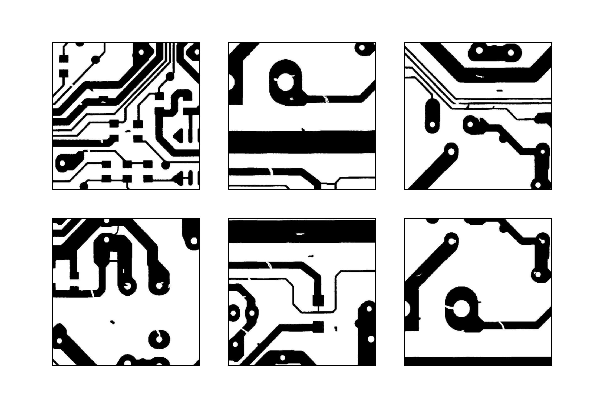

# Project Description 
* The ultralytics version used in this project is 8.1.9 as the foundation. Based on the original ultralytics project, I have added or modified certain modules to optimize and refine it, aiming to validate the improved PCB defect detection method proposed in the paper.

## My Experimental Environment  

- **Operating System**: Windows 10  
- **Python**: 3.8.19  
- **Torch**: 1.13.1+cu117  
- **Torchvision**: 0.14.1+cu117  
- **Timm**: 0.9.8  
- **MMCV**: 2.1.0  
- **MMEngine**: 0.9.0   

## Introduction to Script Files  

- **Script for training the model**: `train.py`  
- **Script for model pruning**: `compress.py`  
- **Script for calculating metrics using the trained model**: `val.py`  
- **Script for inference**: `detect.py`  
- **Script for generating heatmaps**: `yolov8_heatmap.py`  
- **Script for calculating model storage size, inference time, and FPS**: `get_FPS.py`  
- **Script for computing COCO metrics**: `get_COCO_metrice.py`  
- **Script for plotting comparative curves**: `plot_result.py`  
- **Script for testing whether all YAML files run correctly**: `test_yaml.py`  
 

## Setting Up the Project Environment
* Create a virtual environment with essential packages   
``` bash  
conda create -n yolov8 python=3.8 anaconda  
```  
* Switch to the newly created virtual environment
``` bash  
conda activate yolov8 
```   
* Install PyTorch and TorchVision based on your GPU configuration
``` bash  
conda install pytorch==1.13.1 torchvision==0.14.1 torchaudio==0.13.1 pytorch-cuda=11.7 -c pytorch -c nvidia
```    
* Install required packages using pip
```  bash
pip install -r requirements-pip.txt
```     
* Install required packages using conda
```  bash
pip install -r requirements-conda.txt
```     
## Dataset Introduction  
This project aims to validate the feasibility of a lightweight PCB defect detection model based on YOLOv8 using the PKU-Market-PCB (Augmented-Version) and DeepPCB datasets.The raw datasets are all open datasets.  
* The link to the third-party database for raw data access is as follows:  
The PKU-Market-PCB: https://github.com/jianzhang96/MSD.git  
The DeepPCB: https://github.com/tangsanli5201/DeepPCB.git    
* This study uses an augmented dataset to obtain the address:https://drive.google.com/file/d/1aOHH1VzQZNeie0oiwpgP0fDDnSmNZe6f/view?usp=drive_link

### PKU-Market-PCB（Augmented-Version）  
The PKU-Market-PCB dataset was developed by the Intelligent Robotics Laboratory at Peking University and consists of 693 images covering six different defect categories: missing hole, mouse bite, open circuit, short, spur, and spurious copper. Due to the relatively small size of this dataset, we applied various data augmentation techniques, including random cropping, translation, HSV adjustment, brightness variation, and noise injection. These techniques expanded the dataset to 3,660 images, which were divided into training, validation, and test sets in an 8:1:1 ratio.       

### DeepPCB  
The DeepPCB dataset is an open PCB defect detection dataset proposed by Tang et al. It consists of 1,500 images covering the same six defect categories: open, short, mouse bite, spur, pin-hole, and copper. Each image has a resolution of 640 × 640 pixels and contains 3 to 12 defects. These images were captured using a linear scan CCD with a resolution of approximately 48 pixels per millimeter. Consistent with the PKU-Market-PCB dataset, the DeepPCB dataset is also divided into training, validation, and test sets in an 8:1:1 ratio.  

### Dataset Directory  
```plaintext
datasets/
├── PKU-Market-PCB(A-Version)/
│   ├── train/
│   |   ├── images/      # Training set images
│   |   ├── labels/      # Training set labels  
│   ├── valid/
│   |   ├── images/      # Validation set images
│   |   ├── labels/      # Validation set labels 
│   ├── test/
│   |   ├── images/      # Test set images
│   |   ├── labels/      # Test set labels     
│   ├── class.txt
├── DeepPCB/
│   ├── train/
│   |   ├── images/      # Training set images
│   |   ├── labels/      # Training set labels  
│   ├── valid/
│   |   ├── images/      # Validation set images
│   |   ├── labels/      # Validation set labels 
│   ├── test/
│   |   ├── images/      # Test set images
│   |   ├── labels/      # Test set labels  
│   ├── class.txt
├── data_PCB.yaml        # PKU-Market-PCB (Augmented-Version) dataset configuration file  
├── data_DeepPCB.yaml    # DeepPCB dataset configuration file
```  
* PKU-Market-PCB (Augmented-Version) Dataset Configuration File: data_PCB.yaml 
```yaml
train: datasets/PKU-Market-PCB(A-Version)/train
val: datasets/PKU-Market-PCB(A-Version)/valid
test: datasets/PKU-Market-PCB(A-Version)/test

# Classes

nc: 6
names: ['Missing_hole', 'Mouse_bite', 'Open_circuit', 'Short', 'Spur', 'Spurious_copper']

```    
## Improvements Over Original YOLOv8  
To enhance PCB defect detection accuracy and efficiency while reducing model complexity, making it more suitable for resource-constrained industrial platforms, we have made the following optimizations to YOLOv8n:  
### Lightweight Feature Extraction Module: C2f_Star  
* Integrates the C2f (Cross Stage Partial Networks with Fusion) module and the Star_Block structure, significantly reducing model complexity while enhancing feature extraction capabilities.   
* C2f_Star Code Modules:  
```python   
## C2f_Star inherits from C2f and uses Star_Block as its basic component 
class C2f_Star(C2f):
    def __init__(self, c1, c2, n=1, shortcut=False, g=1, e=0.5):
        super().__init__(c1, c2, n, shortcut, g, e)
        self.m = nn.ModuleList(Star_Block(self.c) for _ in range(n))  

#  Definition of Star_Block
class Star_Block(nn.Module):  
    def __init__(self, dim, mlp_ratio=3, drop_path=0.):  
        super().__init__()  
        self.dwconv = Conv(dim, dim, 7, g=dim, act=False)  # Depthwise separable convolution with a 7x7 kernel, grouped by channels  
        self.f1 = nn.Conv2d(dim, mlp_ratio * dim, 1)  # 1x1 convolution to expand the number of channels (by mlp_ratio)  
        self.f2 = nn.Conv2d(dim, mlp_ratio * dim, 1)  # Another 1x1 convolution  
        self.g = Conv(mlp_ratio * dim, dim, 1, act=False)  # 1x1 convolution for dimensionality reduction, restoring original channels  
        self.dwconv2 = nn.Conv2d(dim, dim, 7, 1, (7 - 1) // 2, groups=dim)  # 7x7 depthwise separable convolution, maintaining channel count  
        self.act = nn.ReLU6()  # Uses ReLU6 activation function  
        self.drop_path = DropPath(drop_path) if drop_path > 0. else nn.Identity()  # Optional DropPath mechanism (stochastic residual connection)  

    def forward(self, x):  
        input = x  # Preserve input for residual connection  
        x = self.dwconv(x)  # Pass through depthwise separable convolution  
        x1, x2 = self.f1(x), self.f2(x)  # Generate x1 and x2 via two 1x1 convolutions  
        x = self.act(x1) * x2  # Apply ReLU6 activation to x1, then multiply element-wise with x2  
        x = self.dwconv2(self.g(x))  # Reduce dimensionality first, then apply depthwise separable convolution  
        x = input + self.drop_path(x)  # Add residual connection (with optional DropPath)  
        return x  

```  
### Lightweight Detection Head: GS_Detect  
* Modification: Replaced standard convolution with grouped convolution (GroupConv) in the detection head to reduce computational overhead.  
* GS_Detect Code Modules:  
```python
class Detect_Efficient(nn.Module):
    """YOLOv8 Detect Efficient head for detection models."""
    dynamic = False  # Force grid reconstruction
    export = False  # Export mode
    shape = None
    anchors = torch.empty(0)  # Initialize anchors
    strides = torch.empty(0)  # Initialize strides

    def __init__(self, nc=80, ch=()):  # nc: number of classes, ch: input channels list
        super().__init__()
        self.nc = nc  # Number of classes
        self.nl = len(ch)  # Number of detection layers
        self.reg_max = 16  # DFL related parameter, representing the number of channels for bounding box regression
        self.no = nc + self.reg_max * 4  # Number of outputs per anchor
        self.stride = torch.zeros(self.nl)  # Strides computed during build
        
        # Use Group Convolution for feature extraction to improve computational efficiency
        self.stem = nn.ModuleList(
            nn.Sequential(
                Conv(x, x, 3, g=x // 16),  # 3x3 group convolution
                Conv(x, x, 3, g=x // 16)   # 3x3 group convolution
            ) for x in ch
        )
        
        self.cv2 = nn.ModuleList(nn.Conv2d(x, 4 * self.reg_max, 1) for x in ch)  # Predict bounding box
        self.cv3 = nn.ModuleList(nn.Conv2d(x, self.nc, 1) for x in ch)  # Predict class
        self.dfl = DFL(self.reg_max) if self.reg_max > 1 else nn.Identity()  # Distributed Focal Loss processing

    def forward(self, x):
        """Forward propagation, returning predicted bounding boxes and class probabilities."""
        shape = x[0].shape  # BCHW format
        
        for i in range(self.nl):  # Iterate over all detection layers
            x[i] = self.stem[i](x[i])  # Feature extraction through the stem module
            x[i] = torch.cat((self.cv2[i](x[i]), self.cv3[i](x[i])), 1)  # Combine bbox and class information
        
        if self.training:
            return x  # Return x directly in training mode
        elif self.dynamic or self.shape != shape:
            # Compute anchors and strides
            self.anchors, self.strides = (x.transpose(0, 1) for x in make_anchors(x, self.stride, 0.5))
            self.shape = shape
        
        # Reshape data format for further processing
        x_cat = torch.cat([xi.view(shape[0], self.no, -1) for xi in x], 2)
        
        if self.export and self.format in ('saved_model', 'pb', 'tflite', 'edgetpu', 'tfjs'):
            # Ensure compatibility with different export formats to avoid TF FlexSplitV operations
            box = x_cat[:, :self.reg_max * 4]
            cls = x_cat[:, self.reg_max * 4:]
        else:
            box, cls = x_cat.split((self.reg_max * 4, self.nc), 1)  # Split box and class data
        
        # Convert the predicted distribution into final bounding box coordinates and scale by strides
        dbox = dist2bbox(self.dfl(box), self.anchors.unsqueeze(0), xywh=True, dim=1) * self.strides
        y = torch.cat((dbox, cls.sigmoid()), 1)  # Combine bbox predictions and class predictions
        
        return y if self.export else (y, x)  # Return final result based on export mode

    def bias_init(self):
        """Initialize biases in the Detect layer to ensure reasonable initial classifier probabilities."""
        m = self  # self.model[-1]  # Retrieve the last Detect module
        for a, b, s in zip(m.cv2, m.cv3, m.stride):
            a.bias.data[:] = 1.0  # Initialize box bias
            b.bias.data[:m.nc] = math.log(5 / m.nc / (640 / s) ** 2)  # Initialize class bias to ensure initial probability is around 0.01

```  
### Optimized Bounding Box Regression Loss: Inner-MPDIoU  
* Modification: Designed Inner-MPDIoU loss, which incorporates auxiliary bounding boxes and Minimum Point Distance IoU (MPDIoU) to improve small object localization.  
* Inner-MPDIoU Loss Code Modules:  
```python  
class BboxLoss(nn.Module):
    def __init__(self, reg_max, use_dfl=False):
        """Initialize the BboxLoss module, including regularization maximum and DFL settings."""
        super().__init__()
        self.reg_max = reg_max  # Maximum value for regularization
        self.use_dfl = use_dfl  # Whether to use DFL (Distribution Focal Loss)
        self.nwd_loss = False  # Whether to use NWD (Wasserstein Distance Loss)
        self.iou_ratio = 0.5  # Balance coefficient between IoU and NWD
        
        self.use_wiseiou = True  # Introduce a new method 'wiseiou' in the BboxLoss class
        
        if self.use_wiseiou:
            # Initialize WiseIoU loss, using MPDIoU as the IoU computation method
            # and leveraging auxiliary bounding boxes (Inner-IoU) for additional calculations.
            self.wiou_loss = WiseIouLoss(ltype='MPDIoU', monotonous=False, inner_iou=True, focaler_iou=False)

    def forward(self, pred_dist, pred_bboxes, anchor_points, target_bboxes, target_scores, target_scores_sum, fg_mask, mpdiou_hw=None):
        """Compute the IoU loss."""
        weight = target_scores.sum(-1)[fg_mask].unsqueeze(-1)  # Compute the weight
        
        if self.use_wiseiou:
            # Compute Wise-MPDIoU, including Inner-MPDIoU and Focaler-MPDIoU
            wiou = self.wiou_loss(
                pred_bboxes[fg_mask], target_bboxes[fg_mask], ret_iou=False, ratio=1.3, d=0.0, u=0.95, 
                **{'mpdiou_hw': mpdiou_hw[fg_mask]}
            ).unsqueeze(-1)
            loss_iou = (wiou * weight).sum() / target_scores_sum  # Compute the final IoU loss
        else:
            # Use standard CIoU to compute IoU loss
            iou = bbox_iou(pred_bboxes[fg_mask], target_bboxes[fg_mask], xywh=False, CIoU=True)
            loss_iou = ((1.0 - iou) * weight).sum() / target_scores_sum
                
        if self.nwd_loss:
            # Compute Wasserstein Distance Loss (NWD)
            nwd = wasserstein_loss(pred_bboxes[fg_mask], target_bboxes[fg_mask])
            nwd_loss = ((1.0 - nwd) * weight).sum() / target_scores_sum
            loss_iou = self.iou_ratio * loss_iou + (1 - self.iou_ratio) * nwd_loss  # Combine IoU and NWD losses

        # Compute DFL (Distribution Focal Loss)
        if self.use_dfl:
            target_ltrb = bbox2dist(anchor_points, target_bboxes, self.reg_max)  # Compute target distribution
            loss_dfl = self._df_loss(pred_dist[fg_mask].view(-1, self.reg_max + 1), target_ltrb[fg_mask]) * weight
            loss_dfl = loss_dfl.sum() / target_scores_sum  # Compute the final DFL loss
        else:
            loss_dfl = torch.tensor(0.0).to(pred_dist.device)  # If DFL is not used, set the loss to 0

        return loss_iou, loss_dfl  # Return IoU loss and DFL loss

    @staticmethod
    def _df_loss(pred_dist, target):
        """
        Compute the sum of left and right DFL losses.

        Distribution Focal Loss (DFL) is proposed in Generalized Focal Loss.
        Reference: https://ieeexplore.ieee.org/document/9792391
        """
        tl = target.long()  # Target left index
        tr = tl + 1  # Target right index
        wl = tr - target  # Left weight
        wr = 1 - wl  # Right weight
        return (
            F.cross_entropy(pred_dist, tl.view(-1), reduction="none").view(tl.shape) * wl
            + F.cross_entropy(pred_dist, tr.view(-1), reduction="none").view(tl.shape) * wr
        ).mean(-1, keepdim=True)
```  
### Model Pruning Optimization (LAMP)  
* Modification: Applied Layer Adaptive Multi-granularity Pruning (LAMP) to remove redundant connections, significantly reducing model size and computation cost.  
* Lamp Code Modules:    
```python    
# Skip the head network during the pruning process. 
for k, m in model.named_modules():
        if isinstance(m, Detect_Efficient):
            ignored_layers.append(m.cv2)
            ignored_layers.append(m.cv3)
            ignored_layers.append(m.dfl)    
# The detailed pruning code can be found in the file:ultralytics-main/ultralytics/models/yolo/detect/compress.py 
    
```    
### Experimental Performance Improvements
* 60% reduction in parameters  
* 51% decrease in computational cost  
* 60% reduction in model size  
* 1.7 percentage point increase in detection accuracy (95.0% → 96.7%)


## Train the Model
### Model Configuration File
Model configuration file: ultralytics-main/ultralytics/cfg/models/v8-New/yolov8-MPDIOU-C2f_Star-GS_Detect.yaml
```yaml
nc: 80  # number of classes
scales: # model compound scaling constants, i.e. 'model=yolov8n.yaml' will call yolov8.yaml with scale 'n'
  # [depth, width, max_channels]
  n: [0.33, 0.25, 1024]  # YOLOv8n summary: 225 layers,  3157200 parameters,  3157184 gradients,   8.9 GFLOPs
  s: [0.33, 0.50, 1024]  # YOLOv8s summary: 225 layers, 11166560 parameters, 11166544 gradients,  28.8 GFLOPs
  m: [0.67, 0.75, 768]   # YOLOv8m summary: 295 layers, 25902640 parameters, 25902624 gradients,  79.3 GFLOPs
  l: [1.00, 1.00, 512]   # YOLOv8l summary: 365 layers, 43691520 parameters, 43691504 gradients, 165.7 GFLOPs
  x: [1.00, 1.25, 512]   # YOLOv8x summary: 365 layers, 68229648 parameters, 68229632 gradients, 258.5 GFLOPs

# YOLOv8.0n backbone
backbone:
  # [from, repeats, module, args]
  - [-1, 1, Conv, [64, 3, 2]]  # 0-P1/2
  - [-1, 1, Conv, [128, 3, 2]]  # 1-P2/4
  - [-1, 3, C2f, [128, True]]
  - [-1, 1, Conv, [256, 3, 2]]  # 3-P3/8
  - [-1, 6, C2f, [256, True]]
  - [-1, 1, Conv, [512, 3, 2]]  # 5-P4/16
  - [-1, 6, C2f, [512, True]]
  - [-1, 1, Conv, [1024, 3, 2]]  # 7-P5/32
  - [-1, 3, C2f, [1024, True]]
  - [-1, 1, SPPF, [1024, 5]]  # 9

# YOLOv8.0n head
head:
  - [-1, 1, nn.Upsample, [None, 2, 'nearest']]
  - [[-1, 6], 1, Concat, [1]]  # cat backbone P4
  - [-1, 3, C2f_Star, [512]]  # 12

  - [-1, 1, nn.Upsample, [None, 2, 'nearest']]
  - [[-1, 4], 1, Concat, [1]]  # cat backbone P3
  - [-1, 3, C2f_Star, [256]]  # 15 (P3/8-small)

  - [-1, 1, Conv, [256, 3, 2]]
  - [[-1, 12], 1, Concat, [1]]  # cat head P4
  - [-1, 3, C2f_Star, [512]]  # 18 (P4/16-medium)

  - [-1, 1, Conv, [512, 3, 2]]
  - [[-1, 9], 1, Concat, [1]]  # cat head P5
  - [-1, 3, C2f_Star, [1024]]  # 21 (P5/32-large)

  - [[15, 18, 21], 1, Detect_Efficient, [nc]]  # Detect(P3, P4, P5)

```    
###  Model Training 
* train.py script for training (Modify the YOLOv8 model parameters as needed in the script)  
``` python  
import warnings
warnings.filterwarnings('ignore')
from ultralytics import YOLO

if __name__ == '__main__':
    model = YOLO('ultralytics-main/ultralytics/cfg/models/v8-New/yolov8-MPDIOU-C2f_Star-GS_Detect.yaml')#Load model configuration file
    # model.load('yolov8n.pt') # loading pretrain weights
    model.train(data='datasets/pcb_PCB.yaml',
                cache=False,
                imgsz=640,
                epochs=300,
                batch=16,
                close_mosaic=30,
                workers=8,
                device='0',
                optimizer='SGD', # Using SGD optimizer
                project='runs/Experiment',# Path to save results
                name='yolov8',#  Name of the results folder    
                )
```     
* Run the training script  
```  bash
python ultralytics-main/train.py
```    

###  Model pruning
* Model Pruning Script (Modify pruning parameters and retraining parameters)    
``` python  
import warnings
warnings.filterwarnings('ignore')
import argparse, yaml, copy
from ultralytics.models.yolo.detect.compress import DetectionCompressor, DetectionFinetune
from ultralytics.models.yolo.segment.compress import SegmentationCompressor, SegmentationFinetune
from ultralytics.models.yolo.pose.compress import PoseCompressor, PoseFinetune
from ultralytics.models.yolo.obb.compress import OBBCompressor, OBBFinetune

def compress(param_dict):
    with open(param_dict['sl_hyp'], errors='ignore') as f:
        sl_hyp = yaml.safe_load(f)
    param_dict.update(sl_hyp)
    param_dict['name'] = f'{param_dict["name"]}-prune'
    param_dict['patience'] = 0
    compressor = DetectionCompressor(overrides=param_dict)
    prune_model_path = compressor.compress()
    return prune_model_path

def finetune(param_dict, prune_model_path):
    param_dict['model'] = prune_model_path
    param_dict['name'] = f'{param_dict["name"]}-finetune'
    trainer = DetectionFinetune(overrides=param_dict)
    trainer.train()

if __name__ == '__main__':
    param_dict = {
        # origin
        'model': 'runs/Experiment/yolov8.best.pt',# Load best.pt file of the model to be pruned
        'data':'datasets/pcb_PCB.yaml',# Load dataset configuration file
        'imgsz': 640,
        'imgsz': 640,
        'epochs': 300, 
        'batch': 16,
        'workers': 8,
        'cache': False,
        'optimizer': 'SGD',
        'device': '0',
        'close_mosaic': 30, 
        'project':'runs/Experiment/pruning',# Path to save retrained model
        'name':'yolov8-C2f_Star-MPDIoU-GS_Detect-LAMP(speed_up=1.3)',# Name of retraining results folder
    
        # prune
        'prune_method':'lamp',
        'global_pruning': True,
        'speed_up': 1.3, # Pruning rate parameter
        'reg': 0.0005,
        'sl_epochs': 500,
        'sl_hyp': 'ultralytics-main/ultralytics/cfg/hyp.scratch.sl.yaml',# Configuration file for regular pruning parameters
        'sl_model': None,
    }
    
    prune_model_path = compress(copy.deepcopy(param_dict))
    finetune(copy.deepcopy(param_dict), prune_model_path)
```      
* Run the pruning script  
```  bash
python ultralytics-main/compress.py
```   
##  Model Validation and Inference
### Model Validation Script  
The val.py script is used to evaluate the model's performance in PCB defect detection, assessing accuracy (mAP@50), recall, and inference speed, while saving the results.    
* Validation script  
``` python  
import warnings
warnings.filterwarnings('ignore')
from ultralytics import YOLO

if __name__ == '__main__':
    model = YOLO('runs/Experiment/YOLOv8n/weights/best.pt')# Load best.pt of the model to be validated
    model.val(data='datasets/pcb_PCB.yaml',# Load dataset configuration file
              split='val',
              imgsz=640,
              batch=1,
              save_json=True, # if you need to cal coco metrice
              project='runs/val',# Path to store validation results
              name='exp',# Name of the results folder
              )
```    

### Model Inference Script 
The detect.py script performs inference using the YOLOv8n model for PCB defect detection. It loads the trained model, detects defect categories and confidence scores in input images, visualizes or saves the results, and supports both single and batch image processing, making it suitable for real-world deployment.  
* Inference script 
``` python  
import warnings
warnings.filterwarnings('ignore')
from ultralytics import YOLO

if __name__ == '__main__':
    model = YOLO('runs/Experiment/YOLOv8n/weights/best.pt') # select your model.pt path
    model.predict(source='ultralytics-main/ultralytics/assets',# Folder containing images for inference
                  imgsz=640,
                  project='run/detect',# Path to store inference results
                  name='exp',
                  save=True,
                 
                )
```    
### Notes  
* Configuration file for the ablation experiment:：ultralytics-main/ultralytics/cfg/models/v8-New  
* All file paths are for reference only. It is recommended to use absolute paths when working on the project to avoid errors.  


